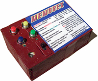
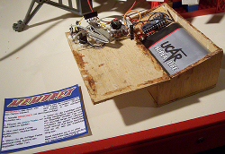
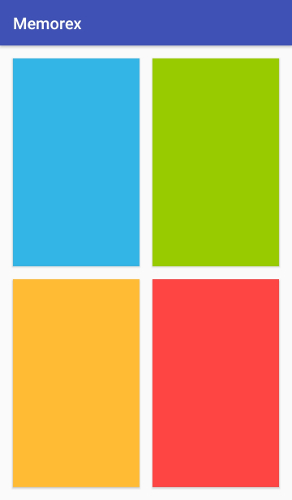

# Memorex

Memorex is a simple game for short time diversion. The challenge is to memorize a sequence of symbols. The sequence is displayed by the game and the player has to repeat it directly afterwards. On success the game increments the sequence by another symbol and repeats. There are four different symbols with a color and tone each.

Memorex is based on the idea of MEMO. MEMO is a computer game for Atari ST which has been developed by Volker Christen (in the early nineties?). Memorex has been developed by [David Hebbeker](https://david.hebbeker.info/) as a tinkering hobby.

Memorex has been deployed on the following platforms:

-   Handheld electronic game
-   Mobile app

## Handheld electronic game

The original Memorex implementation has been developed in January 2005 as a handheld electronic game. It is made of a wooden box with a panel on top. The player uses four colored buttons which are accompanied by a corresponding colored LED. A buzzer plays a tone for each symbol.

The electronics of the game consists of a veroboard on which a simple circuit has been deployed. A 4.5-volt lantern battery provides enough energy to play seemingly infinite games. The [circuit diagram](documentation/res/plan.jpg) has been created with Target 3001!. The electronics consists of the following parts:

-   1 × BC 338-25 (transistor)
-   1 × 1 kΩ
-   4 × 10 kΩ
-   4 × 3mm LED diffuse (green, yellow, red, blue)
-   4 × bush-buttons
-   1 × piezo buzzer
-   1 × microcontroller ATTiny 26 by Atmel

The heart of the game is a [basic program](documentation/res/memorex06.bas) which runs on the ATTiny 26 microcontroller. The program has been compiled and flashed with BASCOM-AVR (MCS Electronics).

## Mobile app

In January 2018 an app for Android platforms has been developed.

### Download and install

Please refer to the [releases page][1] to download the Android application package (APK) file. The ability to install the package is limited on most Android devices. Please consult the Android documentation on [how to enable installation from "Unknown sources"][2] if necessary.

[1]: https://github.com/dhebbeker/memorex-android/releases "release page on GitHub"
[2]: https://developer.android.com/distribute/marketing-tools/alternative-distribution.html#unknown-sources "User opt-in for installing unknown apps"